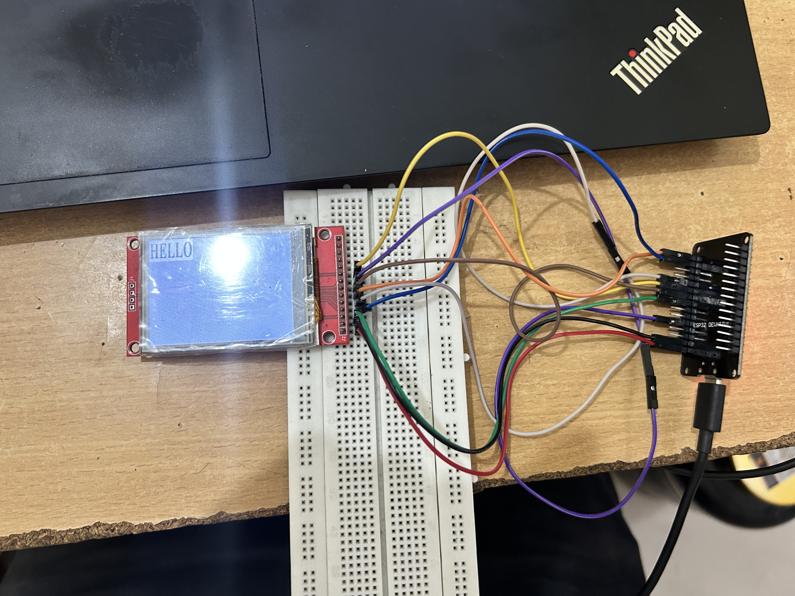

ESP32 SPI TFT Display Project

This project demonstrates interfacing an ESP32 (ESP32-WROOM) with an SPI-based TFT display (ILI9341 driver) using ESP-IDF.

Currently, the firmware displays a "Hello" image on the TFT screen. Upcoming enhancements include receiving commands from an external module (via UART/SPI/BLE – depending on integration) and dynamically updating the TFT display based on those commands.

Features

ESP32-WROOM microcontroller

TFT Display (ILI9341 controller, SPI interface)

Display initialization and test image ("Hello")

Modular code structure for future expansion

Planned Features

Receive commands from external module

Parse and update display content dynamically

Extendable for UI development (e.g., LVGL integration)

## Preview 

Current output on TFT display:
  

Getting Started

Install ESP-IDF
.

Clone this repository:

git clone https://github.com/yourusername/yourrepo.git

Build and flash:

idf.py build flash monitor

License

This project is released under the CC0 / Public Domain License
.